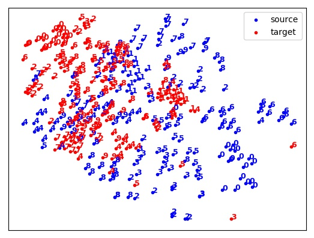
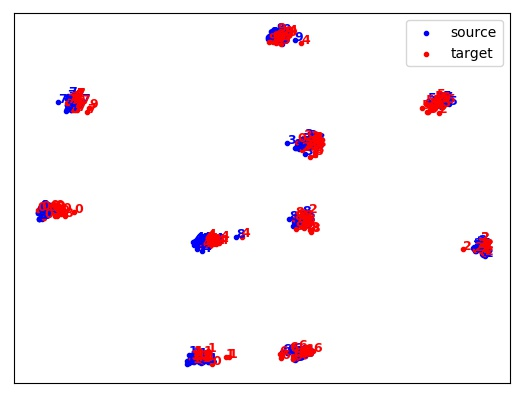

# Adversarial Discriminative Domain Adaptation
A tensorflow implement of 
## Environment
* python 3
* tensorflow 1.09
* sklearn
* matplotlib 2.2.2
* numpy 1.14.2

## Network
Network achitecture referenced LeNet for mnist digits datasets.
* For encoder:
    * 3 x Conv + 1 x Linear
* For classifier:
    * 1 x Conv + softmax
* For Discriminator:
    * 3 x Linear
* More detial can be seem in "adda.py". You can design your network according to your adaptation task.

## Usage
**Note**: This repository is still semi-finished. Dataset only MNIST and USPS are support. 
```
python main.py --step=1 --epoch=20
```
* step:
    * Step 1 is training source network.
    * Step 2 is training target encoder and discriminator.
    * Step 3 is evaluation of adda network
* epoch: the training epoch in the step.
  
# Result
||MNIST(Source)|USPS(Target)|
|:--|:--:|:--:|
|Source Encoder + Source Classifier|99.23%|78.52%|
|Target Encoder + Source Classifier|-|91.38%|
* Target accuracy: 78.52%(without adapting) vs 91.38%(Adapted)
# Visualization result
* MNIST and USPS distribute in 2-dimension and feature map of encoder output after adaptation


